# BrainBlast - Interactive Quiz Game
A modern interactive quiz game featuring Solo & Multiplayer modes, immersive audio,  educational fun facts, and 10 quiz categories.

🌐 **Live Demo:** [Play BrainBlast](https://adlin1307.github.io/BrainBlast-Quiz-Game/)

---

## Intern Details

- **Name:** Adlin A
- **Intern ID:** CITS3666
- **Organization:** Codtech IT Solutions Pvt. Ltd.
- **Domain:** Frontend Web Development
- **Duration:** 4 Weeks

---

## Project Name

BrainBlast - Interactive Quiz Game

---

## Project Scope

BrainBlast is a modern and interactive quiz application developed using HTML, CSS, and JavaScript. The application offers both Solo and Multiplayer game modes with multiple quiz categories, three difficulty levels, immersive background music, sound effects, animated user interfaces, BrainBot commentary, and educational fun facts after every question. Designed with a responsive and visually appealing interface, BrainBlast provides an engaging learning and entertainment experience across desktop and mobile devices.

---

## Technologies Used

- HTML5
- CSS3
- JavaScript (ES6)
- Local Storage
- Web Audio API
- Responsive Web Design

---

## Features

- Interactive Landing Page
- Solo Mode
- Multiplayer Mode
- 10 Quiz Categories
- Three Difficulty Levels
- 30-Second Question Timer
- Difficulty-Based Scoring
- Animated Progress Indicators
- BrainBot Commentary
- Educational Fun Facts
- Dynamic Performance Titles
- Background Music
- Sound Effects
- Avatar Selection
- Pause & Resume Gameplay
- Settings Panel
- Fully Responsive Design

---

## Project Structure

```text
BrainBlast/
│
├── assets/
│
├── css/
│   ├── animations.css
│   ├── game.css
│   ├── landing.css
│   ├── popup.css
│   ├── responsive.css
│   ├── style.css
│   └── themes.css
│
├── data/
│   ├── avatars.json
│   ├── categories.json
│   ├── questions.json
│   ├── results.json
│   └── roasts.json
│
├── documentation/
│   ├── BrainBlast-documentation.pdf
│   └── BrainBlast.docx
│
├── js/
│   ├── app.js
│   ├── game.js
│   ├── multiplayer.js
│   ├── popup.js
│   ├── questions.js
│   ├── scoring.js
│   ├── sounds.js
│   ├── storage.js
│   ├── themes.js
│   ├── timer.js
│   └── ui.js
│
├── screenshots/
│   ├── avatar-selection.png
│   ├── fun-fact.png
│   ├── game-pause.png
│   ├── how-to-play.png
│   ├── landing-page.png
│   ├── Mobile-game.png
│   ├── Mobile-landing-page.png
│   ├── multiplayer-game.png
│   ├── multiplayer-results.png
│   ├── pass-the-device.png
│   ├── reading-time.png
│   ├── set-up-game.png
│   ├── settings.png
│   ├── solo-game.png
│   └── solo-results.png
│
├── index.html
├── README.md
└── .gitignore
```

---

## Screenshots

### Landing Page

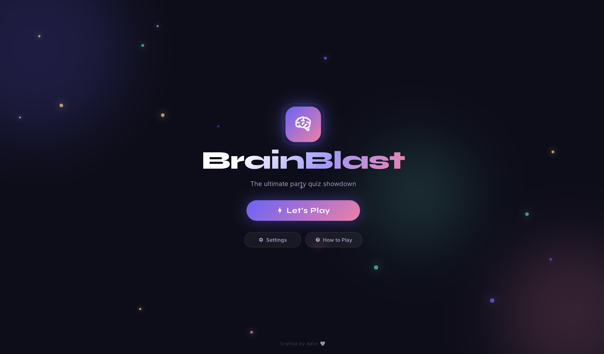

---

### Game Setup

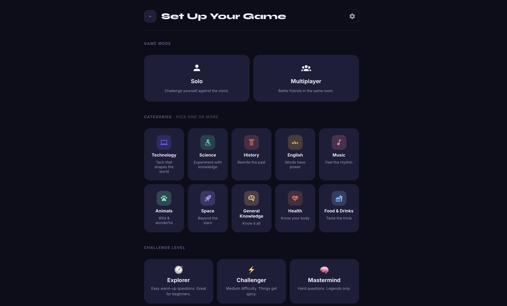

---

### Avatar Selection

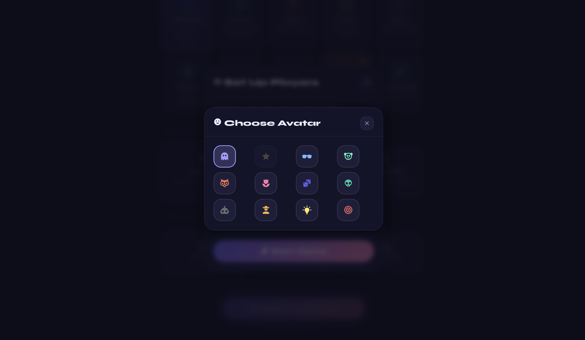

---

### Solo Gameplay

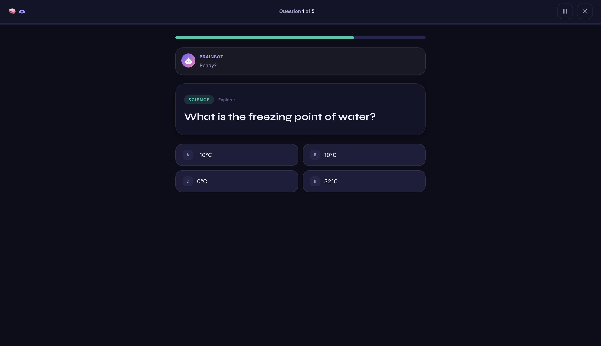

---

### Reading Time

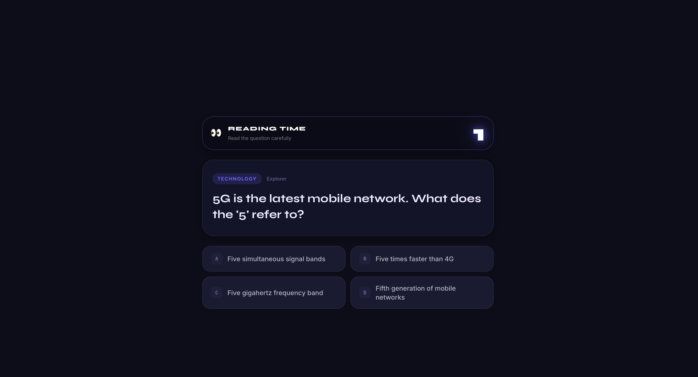

---

### Pause Menu

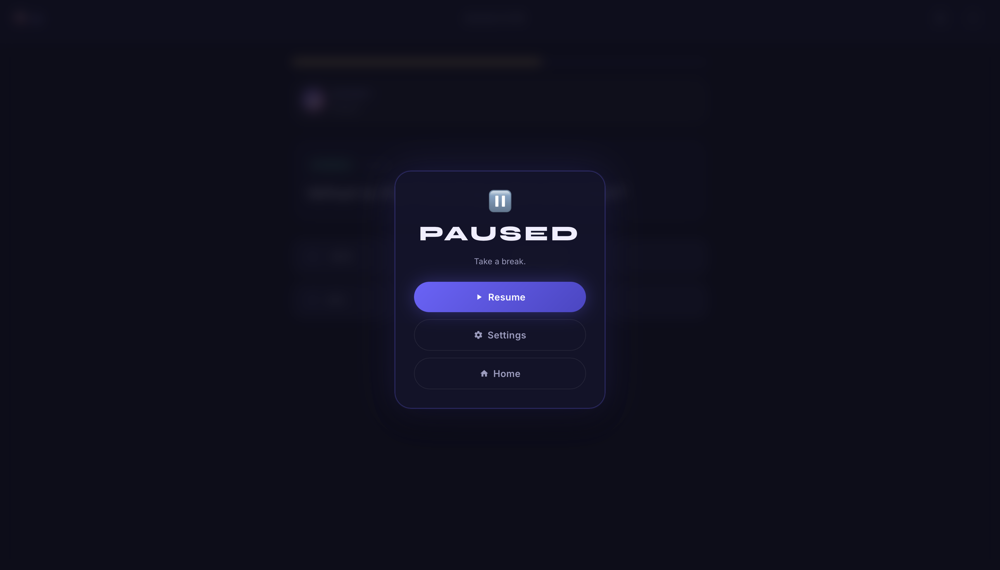

---

### Fun Fact

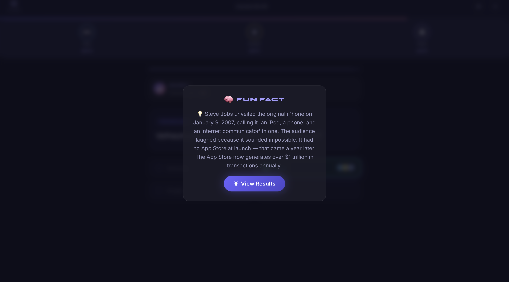

---

### Solo Results

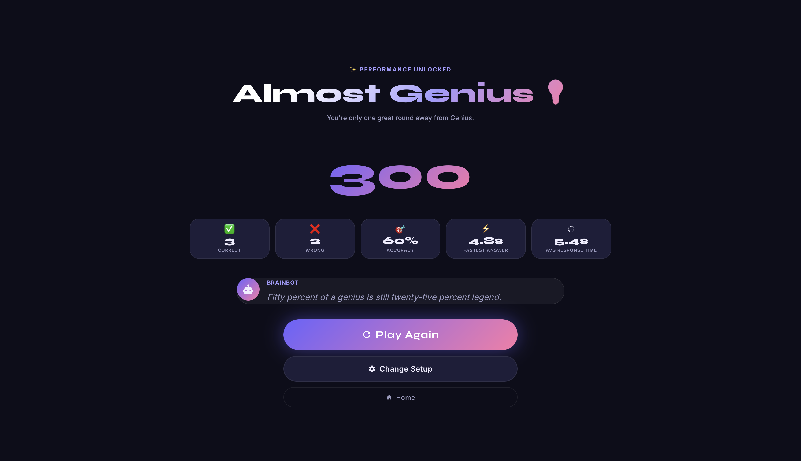

---

### Multiplayer Gameplay

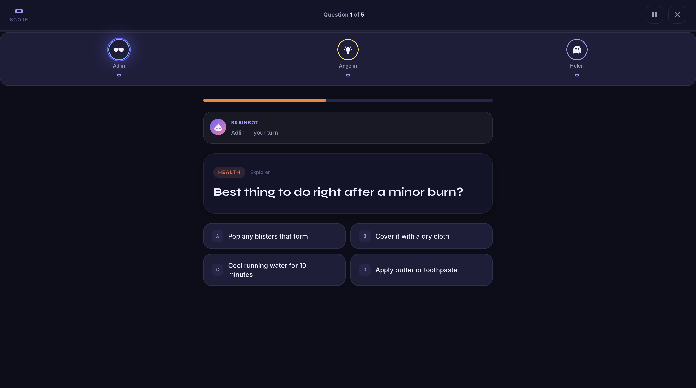

---

### Pass the Device

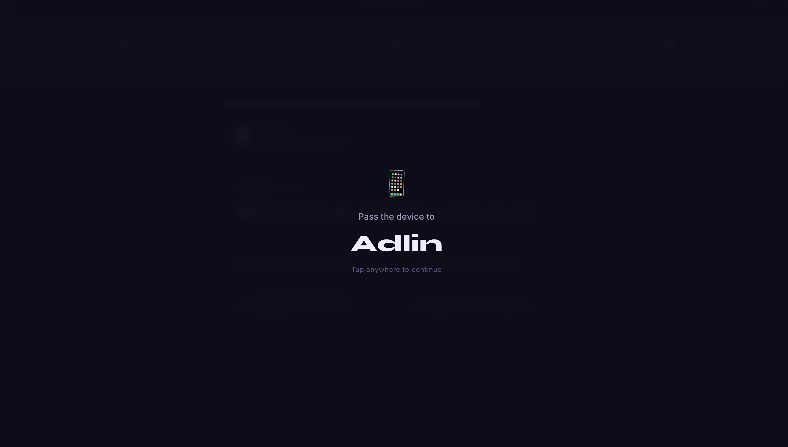

---

### Multiplayer Results

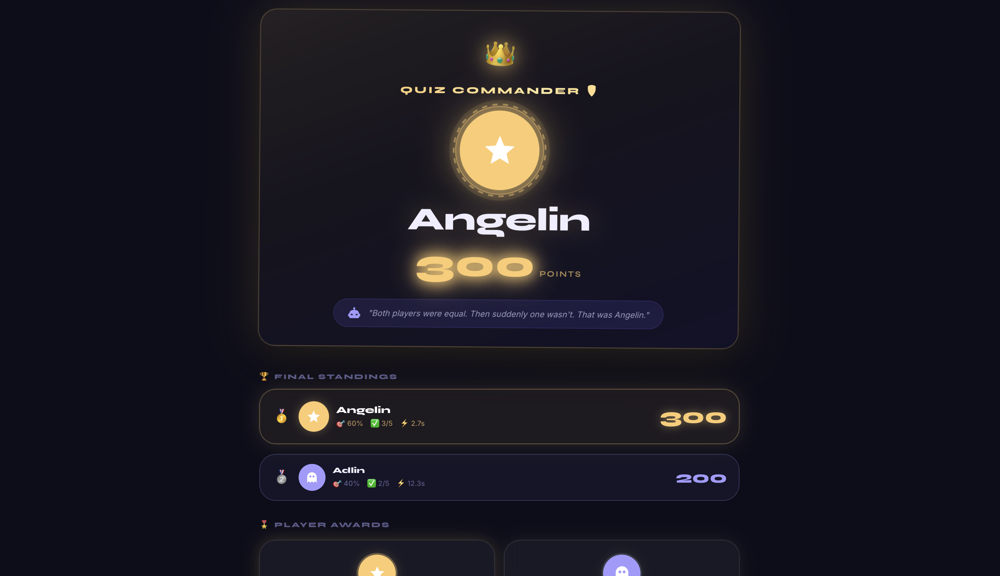

---

### Settings

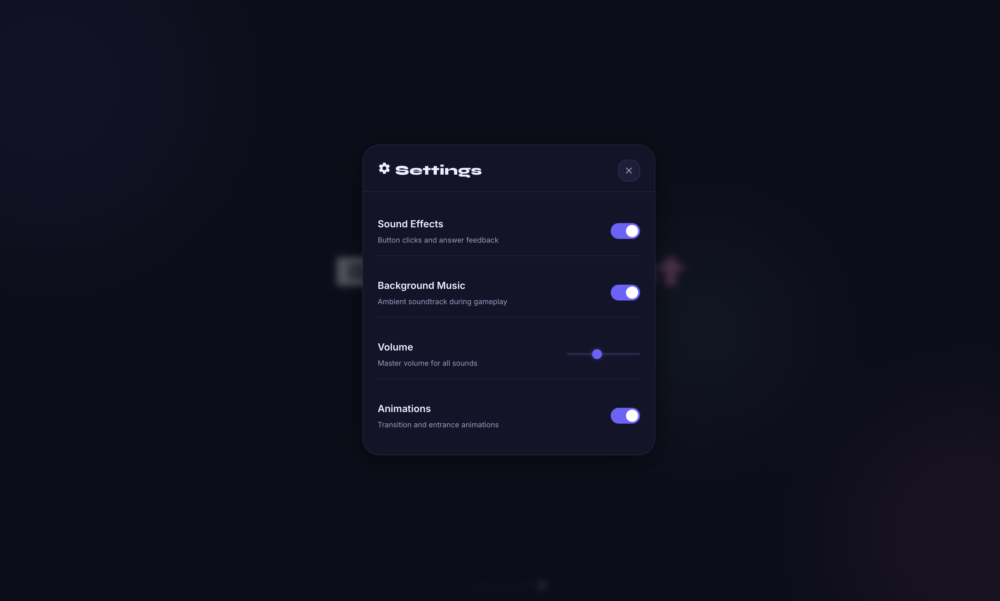

---

### How to Play

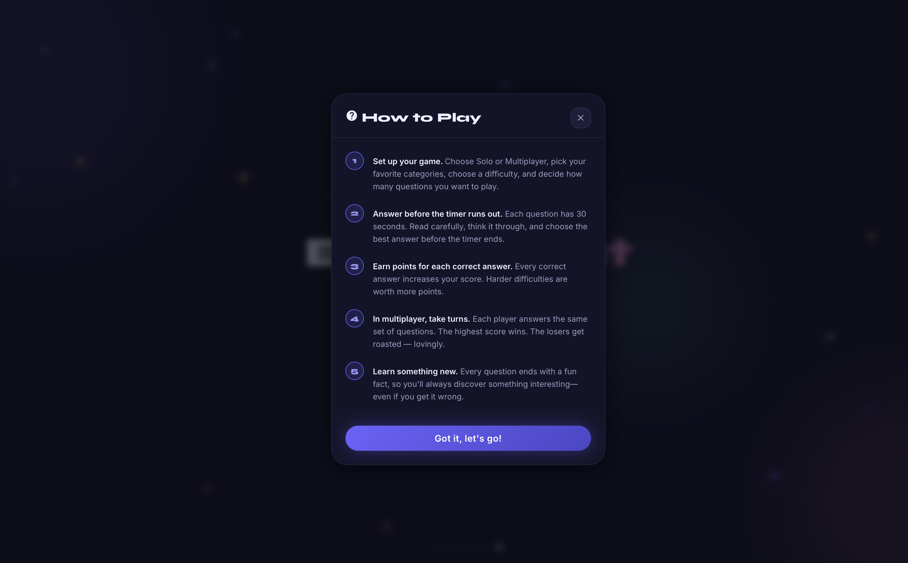

---

### Mobile View - Landing Page

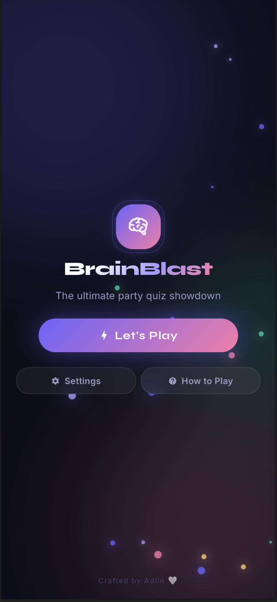

---

### Mobile View - Gameplay

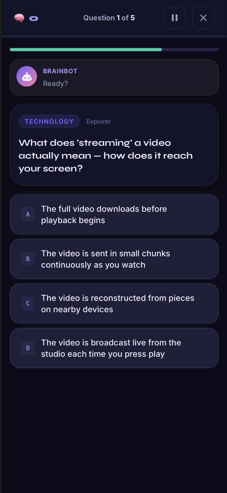

---

## Documentation

The repository includes detailed project documentation covering the project overview, objectives, technologies used, features, project scope, screenshots, future enhancements, and conclusion.

[View Documentation](documentation/BrainBlast-documentation.pdf)

---

## Future Enhancements

- Online Multiplayer Support
- Global Leaderboards
- Player Profiles & Statistics
- Additional Quiz Categories
- Daily Challenges
- AI-Generated Questions
- Custom Quiz Creator
- Multiple Language Support
- Progressive Web App (PWA)

---

## Author

**Adlin A**